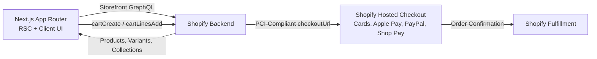

# Headless Shopify Next.js SDK & Starter Architecture

[](https://nextjs.org/)
[](https://shopify.dev/docs/api/storefront)
[](https://www.typescriptlang.org/)
[](https://tailwindcss.com/)

A modular, production-tested **Shopify Storefront backend SDK** and Next.js starter template. Built to connect any custom React / Next.js frontend to Shopify with zero boilerplate, full type-safety, automatic rate-limit protection, and direct PCI-compliant checkout redirection.

---

## Features

- **Storefront API 2025-01 Ready**: Native GraphQL client built with pure `fetch` (zero heavy external Shopify packages).
- **Universal Cart Management**: Complete server & client workflows for cart creation, line updates, removals, discount codes, and buyer identity.
- **Hosted Checkout Redirection**: Converts cart sessions directly into Shopify hosted checkout URLs (`https://<store>.myshopify.com/cart/c/...`).
- **429 & Rate-Limit Shield**: Built-in exponential backoff retries and client IP forwarding (`Shopify-Storefront-Buyer-IP`) to prevent serverless IP throttling on Vercel / AWS.
- **Predictive Type-Ahead Search**: Native query support for real-time suggestions across products, collections, and search phrases.
- **On-Demand Cache Invalidation (ISR)**: `/api/revalidate` webhook route with Shopify HMAC-SHA256 signature verification to purge Next.js cache tags when products change in Shopify.
- **Offline / Mock Fallback**: Includes realistic mock catalog data so the frontend remains interactive even before Shopify credentials are provided.

---

## Architecture Flow



---

## Project Structure

```
├── .env.example                  # Environment template for quick setup
├── SHOPIFY_INTEGRATION_GUIDE.md  # Comprehensive architectural handbook
├── next.config.ts                # cdn.shopify.com image whitelisting
└── src/
    ├── app/
    │   ├── api/
    │   │   ├── cart/route.ts     # Proxy route for cart operations
    │   │   └── revalidate/       # Webhook route for tag-based cache invalidation
    │   ├── products/[handle]/    # Dynamic product detail page (PDP)
    │   ├── layout.tsx            # Global layout with CartProvider
    │   └── page.tsx              # Catalog homepage (PLP)
    ├── components/
    │   ├── CartDrawer.tsx        # Slide-over cart drawer & checkout trigger
    │   ├── Header.tsx            # Navigation & reactive cart counter
    │   ├── ProductCard.tsx       # Catalog product card with quick-add
    │   └── ProductForm.tsx       # Variant picker (size, color) & Add to Bag
    ├── context/
    │   └── cart-context.tsx      # Cart React Context synced to localStorage
    └── lib/
        └── shopify/              # CORE REUSABLE BACKEND SDK
            ├── client.ts         # shopifyFetch with retry & IP forwarding
            ├── config.ts         # Environment validation & sanitization
            ├── index.ts          # Master SDK entrypoint
            ├── mock-data.ts      # Offline fallback fixtures
            ├── mutations.ts      # GraphQL cart mutations
            ├── queries.ts        # GraphQL catalog & search queries
            └── types.ts          # Comprehensive TypeScript models
```

---

## Quick Start

### 1. Clone & Install

```bash
git clone <your-repo-url>
cd ShopifyTest
pnpm install
```

### 2. Environment Variables

Copy `.env.example` to `.env.local`:

```bash
cp .env.example .env.local
```

Fill in your store credentials:

```env
NEXT_PUBLIC_SHOPIFY_STORE_DOMAIN=your-store-name.myshopify.com
NEXT_PUBLIC_SHOPIFY_STOREFRONT_ACCESS_TOKEN=your_storefront_access_token
SHOPIFY_STOREFRONT_API_VERSION=2025-01
```

> **How to get these keys in 2 minutes:**
> 1. In your Shopify Admin, install the official **Headless** sales channel.
> 2. Click **Add storefront**.
> 3. Copy the **Public access token** and your `.myshopify.com` domain.

### 3. Run Development Server

```bash
pnpm dev --port 3001
```

Visit `http://localhost:3001` to view the store.

---

## Using the Backend SDK in Any React / Next.js Project

The entire backend is contained inside [`src/lib/shopify/`](src/lib/shopify/). You can copy that folder into any existing codebase and import any function directly:

```typescript
import {
  getProducts,
  getProduct,
  getCollections,
  predictiveSearch,
  createCart,
  addToCart,
} from "@/lib/shopify";

// Fetch catalog items
const products = await getProducts({ limit: 10, sortKey: "PRICE" });

// Single product with variants & images
const product = await getProduct("hermes-agent-md-files");

// Real-time typeahead search
const searchResults = await predictiveSearch("hermes");

// Create cart & get checkout URL
const cart = await createCart([
  { merchandiseId: "gid://shopify/ProductVariant/123456", quantity: 1 },
]);
console.log(cart.checkoutUrl); // Direct link to Shopify Checkout
```

---

## Webhooks & Instant Cache Purging

Set up a webhook in Shopify Admin pointing to `https://your-domain.com/api/revalidate`:

- **Events**: `products/update`, `products/delete`, `collections/update`
- **Format**: JSON
- **Header verification**: Add `SHOPIFY_WEBHOOK_SECRET` to `.env.local` to verify HMAC signatures with `crypto.timingSafeEqual`.

When you edit a price or product in Shopify, Next.js clears the exact product tag cache on demand.

---

## License

MIT
