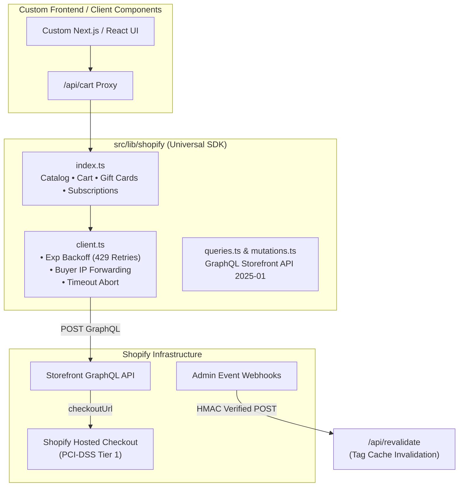

# Shopify Headless Next.js Backend SDK & Integration Architecture

[](https://nextjs.org/)
[](https://shopify.dev/docs/api/storefront)
[](https://www.typescriptlang.org/)

A production-grade, modular **Shopify Storefront Backend SDK** engineered for Next.js (App Router & SSR). Designed as a drop-in integration layer to connect any custom frontend to Shopify's modern GraphQL API with zero lock-in and zero external Shopify runtime dependencies.

---

## 🏗 Architecture & Design Goals



---

## ⚡ Key Backend Capabilities

1. **Storefront API 2025-01 Standard**:
   - 100% compliant with the mandatory Cart API lifecycle (`cartCreate`, `cartLinesAdd`, `cartLinesUpdate`, `cartLinesRemove`).
   - Deprecated `checkoutCreate` completely omitted in accordance with Shopify's platform deprecations.

2. **Advanced Cart & Checkout Operations**:
   - **Subscriptions & Selling Plans**: Support for `sellingPlanId` on cart lines with automatic `sellingPlanAllocation` breakdown.
   - **Gift Cards**: Dedicated `addGiftCard()` and `removeGiftCard()` using Shopify's `cartGiftCardCodesAdd` mutation (tender management separate from discounts).
   - **Promo / Discount Codes**: Full application and error feedback using `cartDiscountCodesUpdate`.
   - **Buyer Identity & SSO**: Links logged-in customer OAuth tokens (`customerAccessToken`) directly into the cart session so stored payment methods and shipping addresses are pre-filled at checkout.

3. **Rate-Limit & Edge Resilience**:
   - **IP Forwarding**: Automatically forwards client IP (`Shopify-Storefront-Buyer-IP` via `x-forwarded-for`) to prevent serverless hosts (Vercel, AWS Lambda) from being rate-limited under a single shared IP.
   - **Exponential Backoff**: Built-in 3-step automatic retry for `429 Too Many Requests` and `503 Service Unavailable`.

4. **Predictive Search & Type-Ahead**:
   - Query engine supporting Shopify's `predictiveSearch` GraphQL query for instant multi-resource suggestions (products, collections, search queries).

5. **On-Demand Webhook Invalidation (ISR)**:
   - Built-in `/api/revalidate` route supporting Shopify Admin webhooks (`products/update`, `collections/update`, etc.) with cryptographic **HMAC SHA-256 signature verification** to purge cache tags dynamically.

---

## 📁 SDK File Organization

The entire reusable backend is isolated inside `src/lib/shopify/` and `src/app/api/`:

```
src/
├── app/api/
│   ├── cart/route.ts           # Non-blocking cart proxy (CRUD, discount, gift cards)
│   ├── revalidate/route.ts     # HMAC-verified webhook cache invalidator
│   └── search/route.ts         # Predictive search endpoint
└── lib/shopify/
    ├── client.ts               # Resilient fetch client (rate limits, backoff, IP)
    ├── config.ts               # Env validation, domain sanitization & fallbacks
    ├── index.ts                # Master SDK exports
    ├── mock-data.ts            # Realistic offline fixtures for dev environments
    ├── mutations.ts            # Complete GraphQL cart & gift card mutations
    ├── queries.ts              # Catalog, collections & predictive search queries
    └── types.ts                # 100% strict TypeScript types for Storefront models
```

---

## 🚀 Quick Setup

### 1. Environment Configuration

Create or update `.env.local`:

```env
# Required: Shopify store domain and Storefront access token
NEXT_PUBLIC_SHOPIFY_STORE_DOMAIN=your-store-name.myshopify.com
NEXT_PUBLIC_SHOPIFY_STOREFRONT_ACCESS_TOKEN=your_storefront_public_token
SHOPIFY_STOREFRONT_API_VERSION=2025-01

# Optional: Private token for SSR buyer-IP forwarding
SHOPIFY_STOREFRONT_PRIVATE_TOKEN=

# Optional: Webhook secret for HMAC cache revalidation
SHOPIFY_WEBHOOK_SECRET=
```

### 2. Using the SDK in Code

```typescript
import {
  getProducts,
  getProduct,
  predictiveSearch,
  createCart,
  addToCart,
  addGiftCard,
  applyDiscountCode,
} from "@/lib/shopify";

// 1. Fetch catalog
const products = await getProducts({ limit: 12, sortKey: "PRICE" });

// 2. Fetch single product by handle
const product = await getProduct("hermes-agent-md-files");

// 3. Create a cart session
const cart = await createCart([
  { merchandiseId: "gid://shopify/ProductVariant/123456", quantity: 1 }
]);

// 4. Apply discount or gift cards
const discountedCart = await applyDiscountCode(cart.id, ["PROMO10"]);
const giftCardCart = await addGiftCard(cart.id, ["GIFT-CARD-XXXX"]);

// 5. Direct customer to hosted checkout
window.location.href = cart.checkoutUrl;
```

---

## 📖 Complete Documentation

See [`SHOPIFY_INTEGRATION_GUIDE.md`](./SHOPIFY_INTEGRATION_GUIDE.md) for full architectural specifications, error codes, webhook registration steps, and team deployment patterns.

---

## License

MIT
