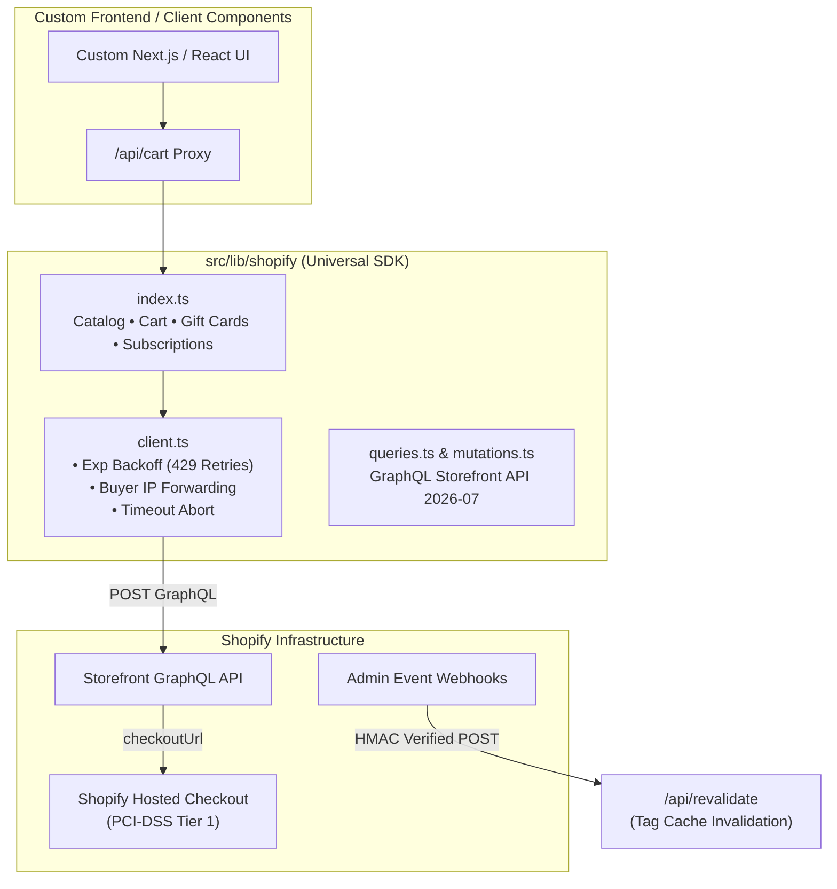

# Shopify Headless Next.js Backend SDK & Integration Architecture

[](https://nextjs.org/)
[](https://shopify.dev/docs/api/storefront)
[](https://www.typescriptlang.org/)

A production-grade, modular **Shopify Storefront Backend SDK** engineered for Next.js (App Router & SSR). Designed as a drop-in integration layer to connect any custom frontend to Shopify's modern GraphQL API with zero lock-in and an optional, explicitly enabled Shopify analytics runtime.

---

## 🏗 Architecture & Design Goals


```mermaid
flowchart TD
    subgraph Client ["Custom Frontend / Client Components"]
        UI[Custom Next.js / React UI]
        API_PROXY["/api/cart Proxy"]
    end

    subgraph Backend_SDK ["src/lib/shopify (Universal SDK)"]
        CLIENT["client.ts\n• Exp Backoff (429 Retries)\n• Buyer IP Forwarding\n• Timeout Abort"]
        SDK["index.ts\nCatalog • Cart • Gift Cards • Subscriptions"]
        QUERIES["queries.ts & mutations.ts\nGraphQL Storefront API 2026-07"]
    end

    subgraph Shopify_Cloud ["Shopify Infrastructure"]
        STOREFRONT["Storefront GraphQL API"]
        CHECKOUT["Shopify Hosted Checkout\n(PCI-DSS Tier 1)"]
        WEBHOOKS["Admin Event Webhooks"]
    end

    UI --> API_PROXY
    API_PROXY --> SDK
    SDK --> CLIENT
    CLIENT -->|POST GraphQL| STOREFRONT
    STOREFRONT -->|checkoutUrl| CHECKOUT
    WEBHOOKS -->|HMAC Verified POST| REVALIDATE["/api/revalidate\n(Tag Cache Invalidation)"]
```

---

## ⚡ Key Backend Capabilities

1. **Storefront API 2026-07 Standard**:
   - 100% compliant with the mandatory Cart API lifecycle (`cartCreate`, `cartLinesAdd`, `cartLinesUpdate`, `cartLinesRemove`).
   - Deprecated `checkoutCreate` completely omitted in accordance with Shopify's platform deprecations.

2. **Advanced Cart & Checkout Operations**:
   - **Subscriptions & Selling Plans**: Plans come from `getProduct`'s `sellingPlanGroups` (and `requiresSellingPlan`); `sellingPlanId` on a cart line with automatic `sellingPlanAllocation` breakdown.
   - **Gift Cards**: Dedicated `addGiftCard()` and `removeGiftCard()` using Shopify's `cartGiftCardCodesAdd` / `cartGiftCardCodesRemove` mutations (removal takes the applied card ids from `cart.appliedGiftCards[].id`, not the codes) (tender management separate from discounts).
   - **Promo / Discount Codes**: Full application and error feedback using `cartDiscountCodesUpdate`.
   - **Buyer Identity & SSO**: Links logged-in customer OAuth tokens (`customerAccessToken`) directly into the cart session so stored payment methods and shipping addresses are pre-filled at checkout.

3. **Rate-Limit & Edge Resilience**:
   - **IP Forwarding**: Automatically forwards client IP (`Shopify-Storefront-Buyer-IP` via `x-forwarded-for`) to prevent serverless hosts (Vercel, AWS Lambda) from being rate-limited under a single shared IP.
   - **Exponential Backoff**: Built-in 3-step automatic retry for `429 Too Many Requests` and `503 Service Unavailable`. Cart changes are never resent after a timeout, so an item is never added twice.

4. **Predictive Search & Type-Ahead**:
   - Query engine supporting Shopify's `predictiveSearch` GraphQL query for instant multi-resource suggestions (products, collections, search queries).

5. **Paged Reads & Filters**:
   - `getProductsPage`, `getCollectionProductsPage` and `searchProducts` return `{ products, pageInfo, filters }`, so lists page with a cursor and filter in Shopify, not in memory. `getCollectionProductsPage` returns `null` for a missing collection, and `getProductsPage` has no filters. `getProductStock` reads per-variant stock when the token has the inventory scope.

6. **Store Content Reads**:
   - `getShop`, `getMenu`, `getPolicies`, `getPolicy` and `getPage` read the shop name, menus, legal policies and info pages from Shopify (cached an hour); `menuLinks` turns menu URLs into site paths.

7. **Drop-in Cart**:
   - `CartProvider` and `useCart()` give a client cart that runs one change at a time, recovers when Shopify drops the cart, and keeps the cart on error. `variants.ts` picks a variant from a shopper's choices.

8. **On-Demand Webhook Invalidation (ISR)**:
   - Built-in `/api/revalidate` route supporting Shopify Admin webhooks (`products/update`, `collections/update`, etc.) with cryptographic **HMAC SHA-256 signature verification** to purge cache tags dynamically.

---

## 📁 SDK File Organization

The entire reusable backend is isolated inside `src/lib/shopify/` and `src/app/api/`:

```
src/
├── app/api/
│   ├── cart/route.ts           # Non-blocking cart proxy (CRUD, discount, gift cards)
│   ├── revalidate/route.ts     # HMAC-verified webhook cache invalidator
│   └── search/route.ts         # Predictive search endpoint
└── lib/shopify/
    ├── cart-client.ts          # Browser client for /api/cart (throws on failure)
    ├── cart-provider.tsx       # CartProvider + useCart() for client components
    ├── cart-store.ts           # The cart's logic without React (one change at a time)
    ├── client.ts               # Resilient fetch client (rate limits, backoff, IP)
    ├── config.ts               # Env validation, domain sanitization & fallbacks
    ├── content.ts              # Shop, menus, policies and pages (cached an hour)
    ├── index.ts                # Master SDK exports
    ├── menu.ts                 # menuLinks: Shopify menu URLs as site paths
    ├── money.ts                # formatMoney: a price in the currency Shopify returned
    ├── mutations.ts            # Complete GraphQL cart & gift card mutations
    ├── queries.ts              # Catalog, collections, content & predictive search queries
    ├── types.ts                # 100% strict TypeScript types for Storefront models
    ├── variants.ts             # findVariant, defaultVariant, isOptionValueAvailable
    └── webhook.ts              # HMAC check for /api/revalidate
```

---

## 🚀 Quick Setup

### 1. Environment Configuration

Create or update `.env.local`:

```env
# Required: Shopify store domain and Storefront access token
NEXT_PUBLIC_SHOPIFY_STORE_DOMAIN=your-store-name.myshopify.com
NEXT_PUBLIC_SHOPIFY_STOREFRONT_ACCESS_TOKEN=your_storefront_public_token
SHOPIFY_STOREFRONT_API_VERSION=2026-07

# Optional: Private token for SSR buyer-IP forwarding
SHOPIFY_STOREFRONT_PRIVATE_TOKEN=

# Required for /api/revalidate: webhook secret (the app client secret when webhooks are created through the Admin API)
SHOPIFY_WEBHOOK_SECRET=
```

### 2. Using the SDK in Code

```typescript
import {
  getProducts,
  getCollectionProductsPage,
  getProduct,
  getMenu,
  predictiveSearch,
  createCart,
  addToCart,
  addGiftCard,
  applyDiscountCode,
} from "@/lib/shopify";

// 1. Fetch catalog
const products = await getProducts({ limit: 12, sortKey: "PRICE" });

// 2. Fetch single product by handle
const product = await getProduct("hermes-agent-md-files");

// 3. A page of a collection, with Shopify's filters; the next page starts at the end cursor
const page = await getCollectionProductsPage({ handle: "summer", limit: 12 });
const next = page?.pageInfo.hasNextPage
  ? await getCollectionProductsPage({ handle: "summer", limit: 12, cursor: page.pageInfo.endCursor ?? undefined })
  : null;

// 4. Header links come from the shop's own menu
const mainMenu = await getMenu("main-menu");

// 5. Create a cart session
const cart = await createCart([
  { merchandiseId: "gid://shopify/ProductVariant/123456", quantity: 1 }
]);

// 6. Apply discount or gift cards
const discountedCart = await applyDiscountCode(cart.id, ["PROMO10"]);
const giftCardCart = await addGiftCard(cart.id, ["GIFT-CARD-XXXX"]);

// 7. Direct customer to hosted checkout
window.location.href = cart.checkoutUrl;
```

In client components use `useCart()` from `@/lib/shopify/cart-provider` instead of calling the cart functions.

---

## 🔌 Connecting a frontend you received

This repo is also a kit you install into someone else's Next.js 16 App Router frontend:

```bash
pnpm shop-setup frontend-audit ../their-frontend   # what it is, where its products and cart live
pnpm shop-setup kit-install ../their-frontend --dry-run
pnpm shop-setup kit-install ../their-frontend       # never overwrites; stops on any conflict
```

Then, inside their repo, wire it with [`docs/frontend-wiring.md`](docs/frontend-wiring.md) and prove it with `pnpm shop-setup frontend-check`. The agent's manual is [`.claude/skills/shopify-connect-frontend/SKILL.md`](.claude/skills/shopify-connect-frontend/SKILL.md).

## 📖 Complete Documentation

See [`SHOPIFY_INTEGRATION_GUIDE.md`](./SHOPIFY_INTEGRATION_GUIDE.md) for full architectural specifications, error codes, webhook registration steps, and team deployment patterns.

---

## License

MIT

## Consent-gated Shopify visits

See [docs/shopify-analytics.md](docs/shopify-analytics.md) for `analytics-configure`, `analytics-check`, consent controls and actual Shopify dashboard validation. The official framework-neutral preview is pinned; visits are off until configured. Existing product/cart hooks require an explicit experimental opt-in and separate validation.
