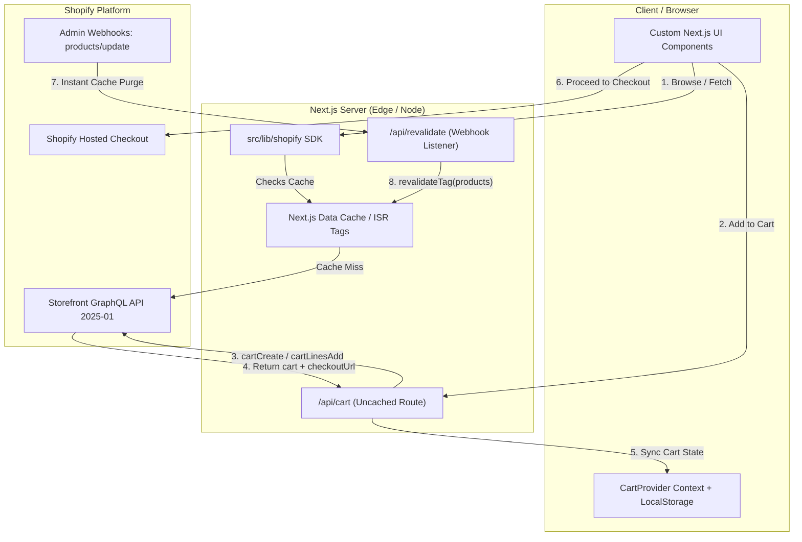

# Shopify Headless SDK & Backend Integration Blueprint
> **For Next.js 14 / 15+ (App Router) & React**  
> *Production-tested with Shopify Storefront API 2025-01*

This guide and codebase provide a modular backend architecture for connecting custom Next.js frontends to Shopify. It eliminates boilerplate and handles rate limits, caching, and checkout redirection out of the box.

---

## 1. Quick Setup (3 Steps)

To drop this backend into any new Next.js project:

### Step 1: Copy the Library Folder
Copy the directory [`src/lib/shopify/`](file:///home/zew0z/ShopifyTest/src/lib/shopify/) and API routes [`src/app/api/`](file:///home/zew0z/ShopifyTest/src/app/api/) into the new project:
```
src/
├── app/
│   └── api/
│       ├── cart/route.ts         # Universal cart CRUD proxy
│       └── revalidate/route.ts   # On-demand ISR cache webhook
└── lib/
    └── shopify/
        ├── client.ts             # Fetch client with rate limiting & retries
        ├── config.ts             # Env sanitation & validation
        ├── index.ts              # Public SDK functions (getProducts, cart, etc.)
        ├── mock-data.ts          # Offline fallback catalog
        ├── mutations.ts          # Storefront GraphQL mutations
        ├── queries.ts            # Storefront GraphQL queries & fragments
        └── types.ts              # 100% strict TypeScript types
```

### Step 2: Configure Environment Variables
Create `.env.local` with these 3 variables:

```env
# 1. Your permanent Shopify domain (Settings -> Domains)
NEXT_PUBLIC_SHOPIFY_STORE_DOMAIN=your-store.myshopify.com

# 2. Public Storefront Access Token (From Headless Channel)
NEXT_PUBLIC_SHOPIFY_STOREFRONT_ACCESS_TOKEN=your_public_storefront_access_token

# 3. Storefront API Version (Default: 2025-01)
SHOPIFY_STOREFRONT_API_VERSION=2025-01

# --- Optional Production Secrets (Recommended for high traffic) ---
# 4. Private Token (Bypasses server IP 429 throttling via Buyer-IP forwarding)
SHOPIFY_STOREFRONT_PRIVATE_TOKEN=shpat_xxx_or_shpss_xxx

# 5. Webhook Secret (Verifies HMAC signatures for on-demand cache purges)
SHOPIFY_WEBHOOK_SECRET=your_webhook_signing_secret
```

### Step 3: Configure `next.config.ts` Image Domain
Add `cdn.shopify.com` to your `remotePatterns`:

```typescript
import type { NextConfig } from "next";

const nextConfig: NextConfig = {
  images: {
    remotePatterns: [
      { protocol: "https", hostname: "cdn.shopify.com", pathname: "/**" },
      { protocol: "https", hostname: "images.unsplash.com", pathname: "/**" },
    ],
  },
};

export default nextConfig;
```

---

## 2. Architecture & How It Works



---

## 3. Core Backend SDK Methods

All methods are available via:
```typescript
import {
  getProducts,
  getProduct,
  getProductRecommendations,
  getCollections,
  getCollection,
  getCollectionProducts,
  createCart,
  getCart,
  addToCart,
  updateCartLines,
  removeFromCart,
  applyDiscountCode,
  updateCartBuyerIdentity,
} from "@/lib/shopify";
```

### Catalog Queries

| Method | Parameters | Description |
| :--- | :--- | :--- |
| `getProducts(options?)` | `{ limit, query, sortKey, reverse, cursor }` | Fetches products list with sorting and filtering. |
| `getProduct(handle)` | `handle: string` | Fetches single product with variants, images, options. |
| `getProductRecommendations(id)` | `productId: string` | Fetches smart recommendations based on product. |
| `getCollections(options?)` | `{ limit, cursor }` | Fetches all custom and smart collections. |
| `getCollection(handle)` | `handle: string` | Fetches collection details by handle. |
| `getCollectionProducts(options)` | `{ handle, limit, sortKey, reverse }` | Fetches all products within a specific collection. |

### Cart & Checkout Mutations

| Method | Parameters | Description |
| :--- | :--- | :--- |
| `createCart(lines?, buyerIdentity?)` | `CartItemInput[], CartBuyerIdentity` | Creates a new cart session and returns `checkoutUrl`. |
| `getCart(cartId)` | `cartId: string` | Retrieves an active cart session from Shopify. |
| `addToCart(cartId, lines)` | `cartId, CartItemInput[]` | Adds product variants to the cart. |
| `updateCartLines(cartId, lines)` | `cartId, CartLineUpdateInput[]` | Updates quantities for line items. |
| `removeFromCart(cartId, lineIds)` | `cartId, string[]` | Removes line items from the cart. |
| `applyDiscountCode(cartId, codes)` | `cartId, string[]` | Applies coupon / promo discount codes. |
| `updateCartBuyerIdentity(cartId, id)`| `cartId, CartBuyerIdentity` | Sets buyer email, phone, or country code. |

---

## 4. Solving Shopify Rate Limits (429 Protection)

In standard server-rendered apps (Vercel, AWS, Cloudflare), all buyer traffic shares your server's IP address. Shopify throttles this with HTTP 429 (`Too Many Requests`).

Our client in [`src/lib/shopify/client.ts`](file:///home/zew0z/ShopifyTest/src/lib/shopify/client.ts) solves this automatically:
1. **Exponential Backoff & Retries**: Automatically retries 429 and 503 errors up to 3 times (`500ms`, `1000ms`, `2000ms`).
2. **Buyer IP Forwarding**: Automatically inspects `x-forwarded-for` and passes `Shopify-Storefront-Buyer-IP` so Shopify throttles per individual customer, not the server.
3. **Private Token Support**: Automatically upgrades to `Shopify-Storefront-Private-Token` when running on the server.

---

## 5. Instant Cache Invalidation (No Rebuilds)

When products are created or updated in Shopify Admin, Next.js does **not** need to be rebuilt.

### Webhook Configuration:
1. In Shopify Admin, navigate to **Settings $\rightarrow$ Notifications $\rightarrow$ Webhooks** (or via the Headless channel).
2. Click **Create webhook**.
3. Event: `Product creation`, `Product update`, `Product deletion`.
4. Format: `JSON`.
5. URL: `https://your-domain.com/api/revalidate`.
6. Copy the **Webhook signing secret** into your `.env.local`:
   ```env
   SHOPIFY_WEBHOOK_SECRET=your_secret_here
   ```

The route [`src/app/api/revalidate/route.ts`](file:///home/zew0z/ShopifyTest/src/app/api/revalidate/route.ts) validates the HMAC signature and executes:
```typescript
revalidateTag("products");
revalidateTag(`product-${payload.handle}`);
```
The updated product appears on the frontend instantly.

---

## 6. How Checkout Works

Shopify provides hosted PCI-DSS compliant checkout:
1. Call `createCart(...)` or `POST /api/cart` with `{ action: "create", lines: [...] }`.
2. Shopify returns a unique checkout URL:
   ```json
   {
     "checkoutUrl": "https://your-store.myshopify.com/cart/c/hWNGZ9lX...?key=..."
   }
   ```
3. When customer clicks **"Proceed to Checkout"**:
   ```typescript
   window.location.href = cart.checkoutUrl;
   ```
4. Shopify handles:
   - Shipping rates & delivery methods
   - Sales tax & VAT
   - Credit card, Apple Pay, Google Pay, PayPal, Shop Pay, Klarna
   - Order confirmation emails and inventory deduction.

---

## 7. Verification Checklist for New Stores

When launching a new client store:
- [ ] Install Shopify **Headless** sales channel.
- [ ] Add Storefront $\rightarrow$ copy **Public Access Token**.
- [ ] Paste `NEXT_PUBLIC_SHOPIFY_STORE_DOMAIN` and `NEXT_PUBLIC_SHOPIFY_STOREFRONT_ACCESS_TOKEN` in `.env.local`.
- [ ] Run `pnpm build` to verify clean compilation.
- [ ] Add 1 test product in Shopify Admin and verify it renders on the frontend.
- [ ] Add product to cart and click checkout to verify redirect.
